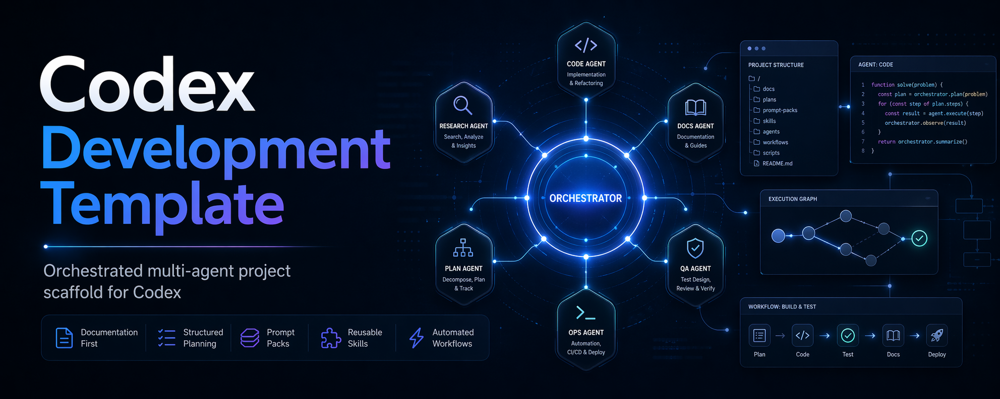

# Codex Development Template



A premium, orchestration-first starter for teams building with [Codex](https://openai.com/codex/).

Use it in two ways:
- **as a GitHub template** to start a new project with structure, prompts, docs, and workflows already in place
- **as a Codex plugin** to make the included skills available in any Codex session

Run **`start`** after cloning or generating a repo, and Codex takes you through setup before implementation begins.

---

## Why This Template Exists

Most AI project templates stop at folders and boilerplate. This one is designed to give Codex an operating system:

- a shared `AGENTS.md` contract
- reusable skills instead of bloated prompts
- prompt packs for onboarding, orchestration, status, and syncing
- living documentation that stays aligned with delivery
- MCP-ready configuration for richer tooling and retrieval

The result is a cleaner, more opinionated starting point for multi-step, multi-agent work.

---

## Quick Start

### Use as a GitHub Template

```bash
gh repo create my-project --template https://github.com/hdtinh57/codex-orchestrated-project-template --private --clone
cd my-project
```

Then open the repo in Codex and run:

```bash
start
```

Codex will walk through onboarding, fill in the initial documentation, and prepare the backlog for execution.

### Use as a Codex Plugin

```bash
git clone https://github.com/hdtinh57/codex-orchestrated-project-template
ln -sf "$(pwd)/codex-orchestrated-project-template/.codex" ~/.codex/plugins/codex-orchestrated-project-template
```

That makes the bundled skills available globally in Codex.

To update later:

```bash
cd codex-orchestrated-project-template && git pull
```

---

## What You Get

### Codex-native orchestration

This template is structured around how Codex actually works in practice:

- **thin agents** with focused roles
- **skills as reusable craft knowledge**
- **prompt packs** for repeatable workflows
- **rules and hooks** for guardrails and consistency
- **living docs** that evolve with the project

### A cleaner starting surface

You start with:

- `AGENTS.md` as the repo-wide operating contract
- `.codex/agents/` for role-specific execution surfaces
- `.codex/skills/` for domain knowledge loaded on demand
- `.codex/prompts/` for common workflows like `start`, `orchestrate`, and `status`
- `.codex/rules/` for file-scoped standards
- `.mcp.json` for shared MCP server configuration

---

## Core Workflows

### `start`

Use once, right after creating a new project.

It guides project setup, turns placeholders into real documentation, seeds the backlog, and prepares the repo for execution.

### `orchestrate <task>`

Use when the work spans multiple concerns or needs coordinated execution.

Example:

```bash
orchestrate add user authentication with email and password
```

Codex can break the task down, route it through the right roles, and execute in waves where parallel work is safe.

### `status`

Use for a quick project health snapshot: branch, active work, recent changes, blockers, and general state.

### `sync-template`

Use to bring the latest template updates into an existing project without replacing local project work.

---

## Agent Model

This template keeps the team shape simple: a small number of broad roles, with domain knowledge loaded via skills only when needed.

| Agent | Role | Typical focus |
| --- | --- | --- |
| `planner` | Direction and structure | planning, backlog governance, architecture decisions |
| `builder` | Product implementation | frontend, backend, database, mobile |
| `designer` | UX and content | design systems, product copy, landing pages |
| `quality` | Verification and docs | testing, QA strategy, user-facing documentation |
| `infra` | Delivery systems | CI/CD, Docker, automation, release pipelines |

This keeps the base prompt surface lean while still letting Codex access specialized craft knowledge when needed.

---

## Built-in Skills

The bundled skills cover the common disciplines needed to ship product work end to end:

- `planning`
- `frontend`
- `backend`
- `database`
- `mobile`
- `design`
- `content`
- `quality`
- `docs`
- `cicd`
- `docker`

They are designed as reusable operating playbooks rather than static documentation dumps.

---

## Repository Structure

```text
.
|-- AGENTS.md
|-- START_HERE.md
|-- TODO.md
|-- PRD.md
|-- SOUL.md
|-- .mcp.json
|-- .codex/
|   |-- agents/
|   |   |-- planner.md
|   |   |-- builder.md
|   |   |-- designer.md
|   |   |-- quality.md
|   |   `-- infra.md
|   |-- skills/
|   |   |-- planning/
|   |   |-- frontend/
|   |   |-- backend/
|   |   |-- database/
|   |   |-- mobile/
|   |   |-- design/
|   |   |-- content/
|   |   |-- quality/
|   |   |-- docs/
|   |   |-- cicd/
|   |   `-- docker/
|   |-- prompts/
|   |   |-- start.md
|   |   |-- orchestrate.md
|   |   |-- status.md
|   |   `-- sync-template.md
|   |-- rules/
|   |   |-- typescript.md
|   |   |-- migrations.md
|   |   `-- tests.md
|   |-- hooks.json
|   `-- templates/
|-- .github/
|   `-- PULL_REQUEST_TEMPLATE.md
|-- .tasks/
`-- docs/
```

---

## Key Conventions

- **`PRD.md` stays protected** unless a human explicitly asks to change it
- **documentation is part of delivery**, not a postscript
- **skills hold domain knowledge**, not giant system prompts
- **rules are injected only when relevant files are active**
- **hooks enforce critical behavior automatically**, instead of relying on reminders

---

## Best Fit

This template works especially well when you want:

- a serious starting point for Codex-based delivery
- stronger structure than a blank repo
- reusable skills across projects
- cleaner orchestration for multi-step implementation work
- a repo that stays legible as the project grows

If you want a minimal starter with almost no process, this template is probably too opinionated. If you want Codex to operate with more consistency and less drift, it is a strong fit.

---

## License

[MIT](LICENSE)
